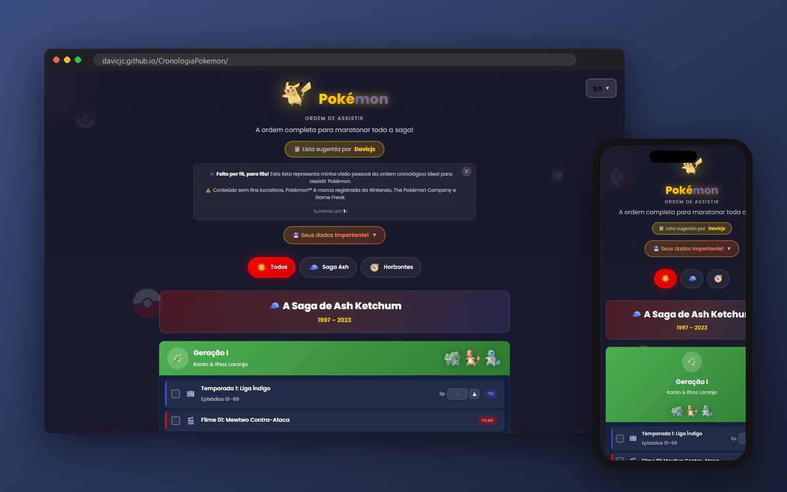

<p align="center">
  
</p>

<h1 align="center">⚡ Pokémon - Ordem de Assistir</h1>

<p align="center">
  <strong>🎬 O guia definitivo para assistir todo o universo Pokémon na ordem correta!</strong>
</p>

<p align="center">
  <a href="https://cronologia-pokemon.davicjc.com/">
    
  </a>
  
  
</p>

<p align="center">
  
  
  
</p>

---


<p align="center">
  
</p>

## 📖 Sobre o Projeto

Você quer assistir **Pokémon** mas não sabe por onde começar? Com tantas temporadas, filmes e especiais, pode ser confuso saber a ordem correta. Este site resolve esse problema!

Este é um **guia interativo e completo** que mostra a ordem cronológica correta para assistir:

- 📺 **Todas as temporadas** do anime
- 🎥 **Todos os filmes**
- ✨ **Especiais e OVAs**

Da clássica **Liga Índigo** até os novos **Horizontes** - tudo organizado de forma clara e bonita!

---

## ✨ Funcionalidades

| Feature | Descrição |
|---------|-----------|
| 🎨 **Design Moderno** | Interface dark mode com as cores icônicas do Pokémon |
| ✨ **Partículas Animadas** | Efeitos visuais interativos no fundo |
| 📱 **Responsivo** | Funciona perfeitamente em celular, tablet e desktop |
| 🔍 **Navegação Fácil** | Encontre rapidamente qualquer temporada ou filme |
| 🌟 **Efeitos Hover** | Animações suaves ao passar o mouse |
| ⚡ **Performance** | Carregamento rápido e otimizado |

---

## 🚀 Como Usar

### Opção 1: Acesse Online
Basta acessar **[cronologia-pokemon.davicjc.com](https://cronologia-pokemon.davicjc.com/)** 🌐

### Opção 2: Rodar Localmente

```bash
# Clone o repositório
git clone https://github.com/seu-usuario/CronologiaPokemon.git

# Entre na pasta
cd CronologiaPokemon

# Abra o index.html no navegador
# Ou use uma extensão como Live Server no VS Code
```

---

## 📂 Estrutura do Projeto

```
📁 CronologiaPokemon/
├── 📄 index.html      # Página principal com todo o conteúdo
├── 🎨 styles.css      # Estilos e animações
├── ⚡ script.js       # Interatividade e efeitos
├── 📋 lista           # Dados da lista
└── 📖 README.md       # Este arquivo
```

---

## 🎨 Preview

<p align="center">
  
  
  
</p>

---

## 🛠️ Tecnologias Utilizadas

- **HTML5** - Estrutura semântica e SEO otimizado
- **CSS3** - Animações, gradientes e design responsivo
- **JavaScript** - Partículas interativas e efeitos dinâmicos
- **Google Fonts** - Fonte Poppins para tipografia moderna
- **Google Analytics** - Acompanhamento de métricas

---

## 📈 SEO

O site está otimizado para mecanismos de busca com:

- ✅ Meta tags completas
- ✅ Open Graph (Facebook, WhatsApp)
- ✅ Twitter Cards
- ✅ Schema.org Structured Data
- ✅ URL canônica

---

## 🤝 Contribuindo

Contribuições são sempre bem-vindas! Se você encontrou algum erro ou quer adicionar algo:

1. Faça um **Fork** do projeto
2. Crie uma **Branch** (`git checkout -b feature/NovaFeature`)
3. **Commit** suas mudanças (`git commit -m 'Add: nova feature'`)
4. **Push** para a branch (`git push origin feature/NovaFeature`)
5. Abra um **Pull Request**

---

## 📝 Licença

Este projeto é apenas para fins educacionais e de fãs. **Pokémon** é uma marca registrada da Nintendo, Game Freak e The Pokémon Company.

---

## 👨‍💻 Autor

Feito com ❤️ por **Davicjc**

<p align="center">
  <a href="https://cronologia-pokemon.davicjc.com/">
    
  </a>
</p>

---

<p align="center">
  
  <br>
  <strong>Gotta Watch 'Em All! ⚡</strong>
</p>
